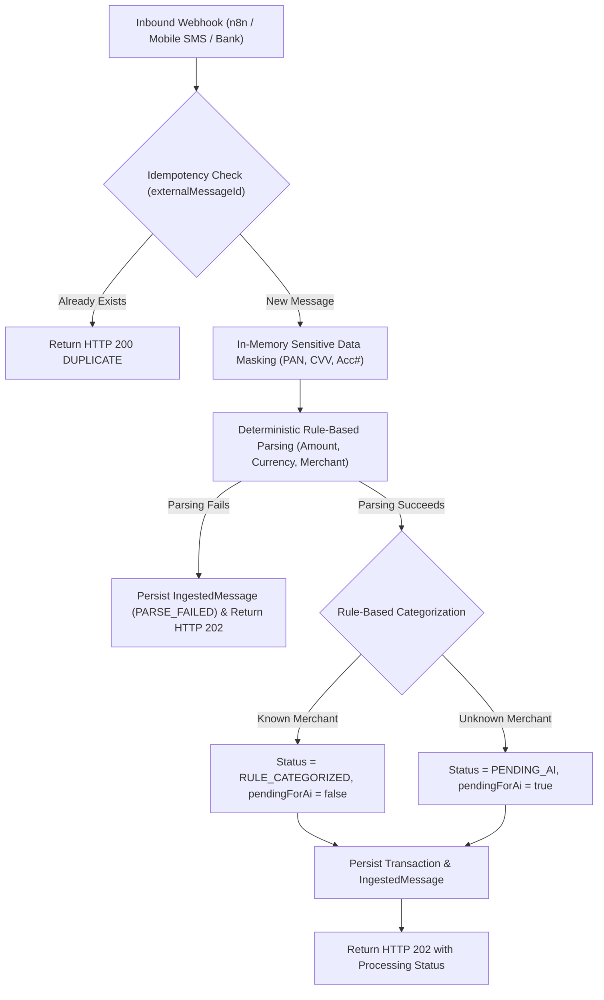

# End-to-End Ingestion & Processing Pipeline (CEN-13)

> **Jira Epic:** [SCRUM-18](https://janiya2k04.atlassian.net/browse/SCRUM-18)  
> **Story:** CEN-13 – Process and persist categorized ingestion events  
> **Component:** `IngestionService.java`, `IngestionController.java`, `TransactionProcessingStatus.java`

This document details the end-to-end transaction processing pipeline in **Centinel Fin AI**, linking HTTP webhook ingress, idempotency checks, privacy masking, deterministic parsing, rule-based categorization, and database persistence.

---

## 1. Pipeline Overview

---

## 2. Processing Lifecycle Statuses

| Status | Description | Action Taken |
| :--- | :--- | :--- |
| `RULE_CATEGORIZED` | Valid transaction with known merchant category | Saved to `transactions` table with category; ready for reporting. |
| `PENDING_AI` | Valid transaction with unknown merchant | Saved to `transactions` as `Uncategorized`; queued for LLM fallback. |
| `PARSE_FAILED` | Ingested message text could not be parsed into valid amount/merchant | `IngestedMessage` saved with failure reason; no invalid transaction created. |
| `DUPLICATE` | `externalMessageId` was previously ingested | Request ignored; HTTP 200 returned with existing ID. |
| `REJECTED` | Authentication failed or validation error | HTTP 401 / 400 returned without persistence. |

---

## 3. Acceptance Criteria Verification

- [x] **Known Merchant Processing:** Ingests and stores categorized transaction (`RULE_CATEGORIZED`, `Groceries`, etc.) in PostgreSQL.
- [x] **Unknown Merchant Processing:** Ingests and stores transaction as `PENDING_AI` with `Uncategorized`.
- [x] **Malformed Message Handling:** Records `PARSE_FAILED` on `IngestedMessage` without crashing the API or creating corrupt transaction records.
- [x] **Idempotency & Deduplication:** Re-submitting identical `externalMessageId` returns `DUPLICATE` without duplicating database rows.
- [x] **End-to-End Test Suite:** Verified via `IngestionControllerTest.java` and `IngestionServiceTest.java`.
