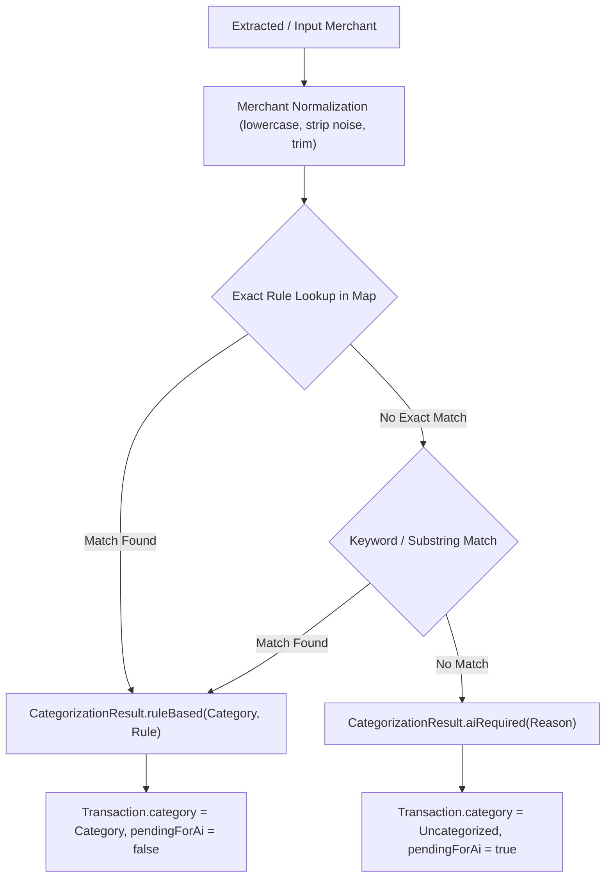

# Rule-Based Merchant Categorization Engine (CEN-12)

> **Jira Epic:** [SCRUM-17](https://janiya2k04.atlassian.net/browse/SCRUM-17)  
> **Story:** CEN-12 – Implement rule-based merchant categorization engine  
> **Component:** `MerchantCategorizationService.java`, `Category.java`, `CategorizationSource.java`, `CategorizationResult.java`

This document outlines the architecture, starter category set, normalization rules, and AI fallback triggering mechanism for deterministic merchant categorization in **Centinel Fin AI**.

---

## 1. Objectives & Principles

1. **Instant Categorization:** Familiar merchants (Keells, Cargills, Uber, PickMe, Dialog, Netflix, etc.) are categorized instantly via in-memory rule lookups without incurring LLM latency or cost.
2. **Transparent Provenance:** Every categorized transaction records its provenance source (`RULE_BASED`, `AI_FALLBACK`, or `MANUAL`).
3. **Safe AI Delegation:** Unmatched or ambiguous merchants are flagged with `isAiRequired = true` and `pendingForAi = true` for processing by the AI fallback pipeline after sensitive data masking.

---

## 2. Starter Category Set

| Category Enum | Display Name | Example Target Merchants |
| :--- | :--- | :--- |
| `GROCERIES` | Groceries | `Keells Super`, `Cargills Food City`, `Glomark`, `Spar`, `Whole Foods`, `Trader Joe's` |
| `TRANSPORT` | Transport | `Uber`, `PickMe`, `Bolt`, `Lyft`, `Delta Air Lines`, `Ceypetco`, `IOC Fuel` |
| `FOOD_AND_DINING` | Food and Dining | `Starbucks`, `Blue Bottle Coffee`, `McDonald's`, `KFC`, `Domino's`, `Pizza Hut` |
| `BILLS_AND_UTILITIES` | Bills and Utilities | `Dialog Axiata`, `Mobitel`, `SLT Mobitel`, `CEB Electricity`, `LECO`, `Water Board` |
| `SUBSCRIPTIONS` | Subscriptions | `Netflix`, `Spotify`, `Apple`, `Google Play`, `YouTube Premium`, `Disney+` |
| `SHOPPING` | Shopping | `Daraz`, `Amazon`, `Zara`, `IKEA`, `AliExpress`, `eBay` |
| `HEALTHCARE` | Healthcare | `Asiri Hospital`, `Nawaloka`, `Lanka Hospitals`, `Durdans`, `Pharmacies` |
| `ENTERTAINMENT` | Entertainment | `Cinema`, `PVR`, `Scope Cinemas`, `Steam`, `PlayStation`, `Xbox` |
| `EDUCATION` | Education | `Coursera`, `Udemy`, `EdX`, `Universities`, `Schools`, `Tuition` |
| `OTHER` | Other | General unclassified items |

---

## 3. Categorization & Normalization Lifecycle

---

## 4. Acceptance Criteria Verification

- [x] `Keells Super` ➔ `Groceries` (`RULE_BASED`)
- [x] `Uber` ➔ `Transport` (`RULE_BASED`)
- [x] Case-insensitivity (`UBER`, `uber`, `Uber`, `KEELLS SUPER`) ➔ Correct category preserved.
- [x] Unknown merchants (`Mysterious Boutique X99`) ➔ `aiRequired = true`, `source = UNCATEGORIZED`, `category = null`.
- [x] Known merchant categorization returns `CategorizationSource.RULE_BASED`.
- [x] Comprehensive parameterized tests in `MerchantCategorizationServiceTest.java`.
