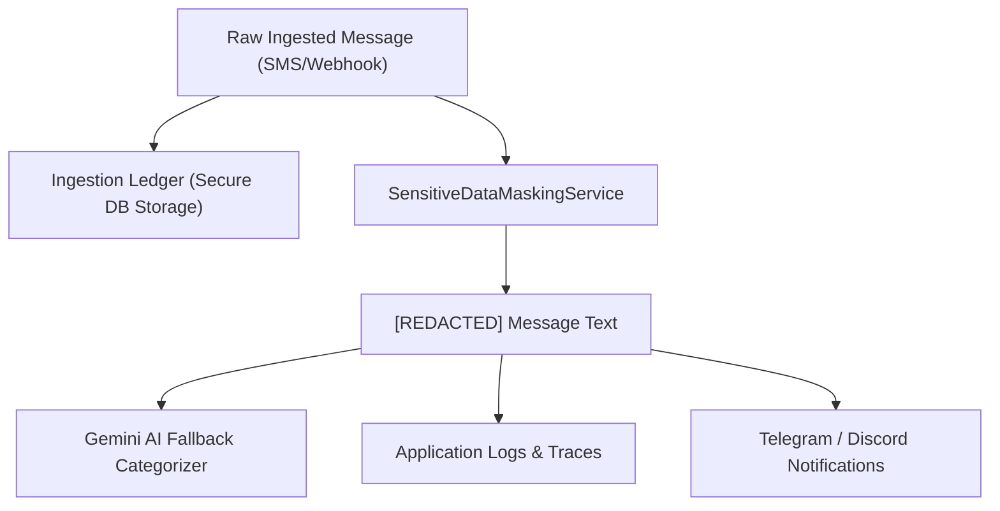

# Sensitive Data Masking & Privacy Architecture (CEN-10)

This document details the design, regex patterns, lifecycle integration, limitations, and future improvements of the sensitive-data masking engine in **Centinel Fin AI**.

---

## 1. Objectives & Privacy Principles

Centinel Fin AI adheres to **Privacy by Design**:
* Sensitive financial identifiers (primary account numbers, card endings, account numbers, security codes) are **never sent to external AI models (e.g. Gemini LLM)** in plaintext.
* Detailed application logs never output raw financial numbers.
* Redaction occurs in-memory before any outbound network call or log statement.

---

## 2. Supported Masking Patterns & Replacements

| Category | Pattern Examples | Output Format |
| :--- | :--- | :--- |
| **Card Endings** | `Visa card ending 1234` `Mastercard ending in 5678` `Card *9988` `Card no. 4321` | `Visa card ending [REDACTED]` `Mastercard ending in [REDACTED]` `Card [REDACTED]` `Card no. [REDACTED]` |
| **Bank Account Numbers** | `Account 001234567890` `A/C 12345678` `Acc No: 9876543210` `Account ending in 4321` | `Account [REDACTED]` `A/C [REDACTED]` `Acc No: [REDACTED]` `Account ending in [REDACTED]` |
| **Full Card PANs (13–19 digits)** | `4111 2222 3333 4444` `4111-2222-3333-4444` `4111222233334444` | `[REDACTED]` |
| **CVV / OTP / PIN / Security Codes** | `CVV: 123` `CVC 456` `OTP: 123456` `Security code: 9988` | `CVV: [REDACTED]` `CVC: [REDACTED]` `OTP: [REDACTED]` `Security code: [REDACTED]` |
| **Amounts & Dates (Preserved)** | `LKR 2,500.00` `USD 50.00` `2026-09-05` | **Preserved intact** (essential for ledger & analytics) |

---

## 3. Masking in the Application Lifecycle

---

## 4. Current Limitations

1. **Unlabeled Account Numbers**:
   * If a transaction notification mentions a 10-digit number without an accompanying label (such as `Account`, `A/C`, `Acc No`), regex heuristics avoid aggressive replacement to prevent redacting non-sensitive reference IDs or invoice numbers.
2. **International IBAN / Non-standard SWIFT Formats**:
   * Current regex patterns target standard retail banking SMS patterns (Sri Lankan, US, UK, SEPA cards/accounts). Complex international IBANs (e.g. `GB29 XAAA 2014 5612 3456 78`) with custom spaces require labeled prefixes.
3. **Language Support**:
   * Current patterns match standard English banking notifications. Sinhala/Tamil script notifications or mixed transliterations (e.g., `Ginum Ankaya`) require dedicated localized keyword dictionaries.

---

## 5. Future Improvements & Roadmap

1. **Contextual Named Entity Recognition (NER)**:
   * Introduce a lightweight local NER model or Microsoft Presidio integration for context-aware entity detection in ambiguous multi-lingual messages.
2. **Consistent Tokenization / Salted Hashing**:
   * Instead of a static `[REDACTED]`, provide an option for deterministic pseudonymous tokens (e.g., `[CARD_TOKEN_a8f9]`) so downstream analytics can group repeated spending by card without learning the real PAN.
3. **Custom Per-User Masking Rules**:
   * Allow users to specify personal account masks or nickname mappings (e.g., `My Commercial Bank Account` -> `Primary Debit`).
